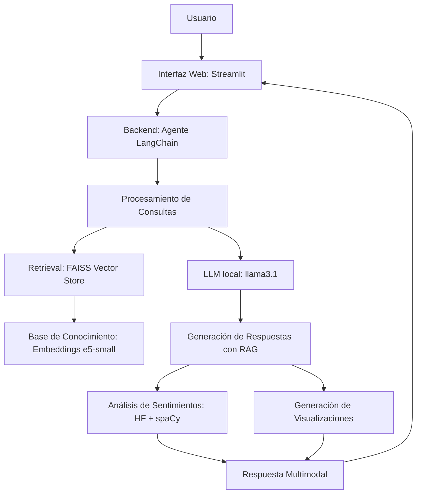

# Contexto
En los últimos años Colombia experimentó transformaciones sociales, políticas y económicas reflejadas en la opinión pública. En el proyecto _Humanidades digitales y esfera pública_ de la Universidad EAFIT se recopilaron ~13k columnas de opinión de periódicos colombianos (2018–2020).
- **Problema**: Los métodos tradicionales de análisis de opinión son insuficientes para procesar grandes volúmenes de texto, extraer insights profundos con respuestas contextualizadas.
- **Solución**: Un agente conversacional autónomo que combina:
  - Análisis de sentimientos (detección de sarcasmo, emociones complejas).
  - Generación de informes contextuales basados en RAG para evitar alucinaciones .
  - Visualización interactiva de tendencias de opinión.
- **Público Objetivo**: Periodistas, investigadores sociales, entidades gubernamentales y organizaciones de la sociedad civil.

# Agente Gauteovan IA

Ese proyecto propone la base para un agente conversacional multimodal, que integra análisis de texto con generación de visualizaciones (gráficos, word clouds) y resúmenes. Es **100% local** (requisitos mínimos: 16 GB RAM | Intel core i5).

> Gauteovan es la diosa de todas las cosas en la cultura Tairona

## *Arquitectura del Sistema*




## 🚀 Puesta en marcha (pasos mínimos)
1) **Instala dependencias**
Asegurate que que el directorio de trabajo está en el directorio de trabajo `cd C:\path\to\AgenteGauteovanIA`, una vez ahí crea el entorno virtual:
```bash
python -m venv .venv 
.venv\Scripts\activate
pip install -U pip
pip install -r requirements.txt
pip install ollama langchain langchain-community duckduckgo-search pandas
python -m spacy download es_core_news_lg
```
2) **Instala Ollama** y modelos locales (en otra terminal):
```bash
# https://ollama.com/download
ollama pull llama3.1:8b-instruct
```
3) **Construye los índices** 
1. Ingesta: Lee el excel, lo limpia, divide en `chunks` sobrepuestos y guarda en un `.parket` con metadata: `'doc_id', 'autor', 'fecha', 'diario', 'título', 'vínculo', 'row_idx', 'chunk', 'chunk_id'`
2. FAISS: Crea el índice vectorial con FAISS para búsqueda semántica, usando embeddings de `multilingual-e5-small`. Guarda el indice vectorial en `data/indexes/faiss.index` y los respectivos metadatos por `chunk`
3.  BM25: Crear el índice léxico tipo BM25 para búsqueda por keywords.


```bash
python scripts/build_index.py
```
5) **Lanza la app**

```bash
streamlit run app/streamlit_app.py
```

## 📁 Estructura
```
colombia-opinion-agent/
├─ app/
│  ├─ streamlit_app.py
│  └─ pages/
│     ├─ 1_Chat.py
│     ├─ 2_Buscador_avanzado.py
│     ├─ 3_Analisis_NLP.py
│     └─ 4_Reportes_y_Graficas.py
├─ data/
│  ├─ raw/Corpus_completo_revisado.xlsx      # (pon aquí tu archivo)
│  ├─ processed/chunks.parquet  # (generado)
│  └─ indexes/
│      ├─ faiss.index           # (generado)
│      ├─ faiss_meta.parquet    # (generado)
│      └─ bm25.pkl              # (generado; o sqlite.db si migras a FTS5)
├─ scripts/
│  ├─ build_index.py
│  └─ eval_rag.py               # (plantilla)
├─ src/
│  ├─ __init__.py
│  ├─ ingest.py
│  ├─ index_faiss.py
│  ├─ index_bm25.py
│  ├─ search_hybrid.py
│  ├─ prompts.py
│  ├─ rag_chain.py
│  ├─ nlp_tools.py
│  ├─ plots.py
│  └─ utils.py
├─ tests/
├─ requirements.txt
└─ README.md
```

## 🧠 Conceptos clave
- **RAG híbrido**: FAISS (embeddings `intfloat/multilingual-e5-small`) + BM25 (rank-bm25). Fusión con **RRF**.
- **Citas**: cada afirmación clave cita `[autor, periódico, fecha, título, doc_id]`.
- **NLP**: spaCy (`es_core_news_lg`) para NER; BETO para sentimiento; zero-shot opcional para tópicos.

## 📌 Notas
- Este esqueleto corre **CPU-only**. Si tienes GPU, Transformers y Sentence-Transformers la aprovecharán.
- Si tu Excel difiere, ajusta `src/ingest.py` (renombrado de columnas).
- Para resultados más “seguros”, usa `temperature=0.2` en `rag_chain.py`.

## 🧪 Evaluación (rápida)
- Especifica 30–50 queries de prueba en `scripts/eval_rag.py`, mide `Recall@K` y latencias por etapa.
- Activa el logging en `app/streamlit_app.py` si quieres conservar conversaciones.

¡Listo para iterar! Cualquier mejora (FTS5, reranking, filtros UI) la puedes añadir sin romper el flujo base.
